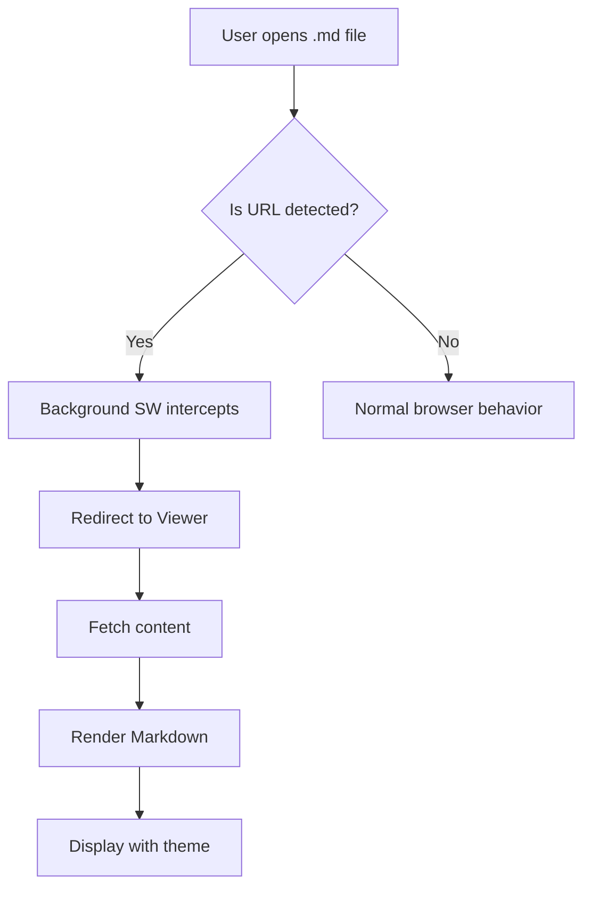
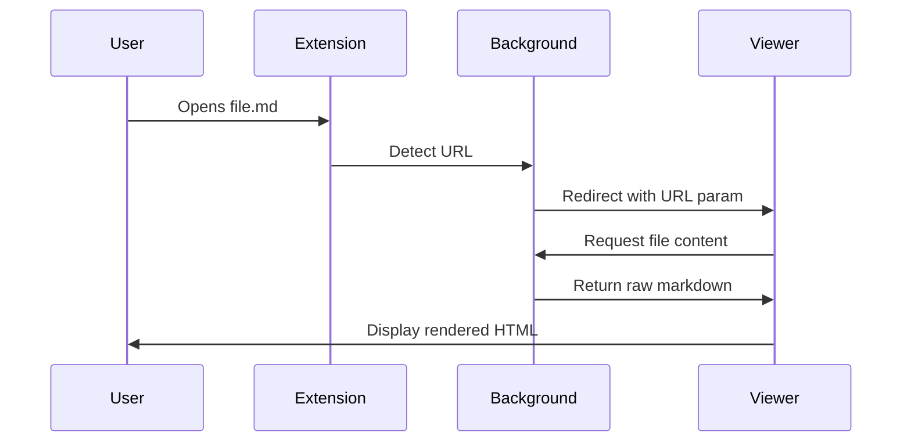

# mymd Full Feature Test

A comprehensive test document for verifying all supported Markdown syntax features.

---

## 1. Headings

# Heading 1
## Heading 2
### Heading 3
#### Heading 4
##### Heading 5
###### Heading 6

---

## 2. Inline Formatting

Plain text with **bold**, *italic*, ***bold italic***, ~~strikethrough~~, `inline code`, and ==highlighted text==.

Superscript: E=mc^2^, Subscript: H~2~O.

Inserted text: ++inserted++.

---

## 3. Paragraphs & Line Breaks

This is a paragraph with multiple sentences. Lorem ipsum dolor sit amet, consectetur adipiscing elit.

This is another paragraph. A blank line separates paragraphs.

---

## 4. Links & Images

[External link](https://example.com)

[Link with title](https://example.com "Example Domain")


---

## 5. Blockquotes

> This is a simple blockquote.

> Nested blockquotes:
>
> > Level 2 blockquote
> >
> > > Level 3 blockquote

---

## 6. Lists

### Unordered List

- Item 1
- Item 2
  - Nested item 2.1
  - Nested item 2.2
    - Deeply nested 2.2.1
- Item 3

### Ordered List

1. First item
2. Second item
   1. Sub-item 2.1
   2. Sub-item 2.2
3. Third item

### Task List

- [x] Completed task
- [ ] Incomplete task
- [x] Another completed task
- [ ] Another incomplete task

---

## 7. Tables

| Name       | Type     | Description              | Required |
|------------|----------|--------------------------|----------|
| `theme`    | string   | Theme name               | Yes      |
| `fontSize` | number   | Font size in pixels      | No       |
| `darkMode` | boolean  | Enable dark mode         | No       |
| `customCSS`| string   | Custom CSS overrides     | No       |

### Wide Table

| Feature              | GitHub | Typora | Academic | Reader | Minimal |
|----------------------|:------:|:------:|:--------:|:------:|:-------:|
| Light mode           | ✅     | ✅     | ✅       | ✅     | ✅      |
| Dark mode            | ✅     | ✅     | ✅       | ✅     | ✅      |
| Serif fonts          | ❌     | ❌     | ✅       | ✅     | ❌      |
| Minimal shadows      | ❌     | ❌     | ❌       | ❌     | ✅      |

---

## 8. Code Blocks

### JavaScript

```javascript
async function fetchMarkdown(url) {
  const response = await fetch(url)
  if (!response.ok) {
    throw new Error(`HTTP error! status: ${response.status}`)
  }
  return response.text()
}

// Usage
fetchMarkdown('https://example.com/README.md')
  .then(md => console.log(md))
  .catch(err => console.error(err))
```

### Python

```python
def calculate_reading_time(text: str, wpm: int = 200) -> int:
    """Calculate estimated reading time in minutes."""
    words = len(text.split())
    return max(1, round(words / wpm))

# Example
content = "Lorem ipsum " * 500
print(f"Reading time: {calculate_reading_time(content)} minutes")
```

### Bash

```bash
#!/bin/bash
# Build and reload Chrome extension
pnpm build && echo "Build successful!"
# Load in Chrome DevTools
open -a "Google Chrome" "chrome://extensions/"
```

### TypeScript

```typescript
interface ThemeConfig {
  name: string
  colorMode: 'light' | 'dark' | 'system'
  cssVariables: Record<string, string>
}

function applyTheme(config: ThemeConfig): void {
  const root = document.documentElement
  for (const [key, value] of Object.entries(config.cssVariables)) {
    root.style.setProperty(key, value)
  }
}
```

### Unknown Language

```unknown-lang
This is a code block with an unknown language.
It should still render as a preformatted code block.
    Indentation should be preserved.
```

---

## 9. Mermaid Diagrams





---

## 10. Math (LaTeX / KaTeX)

Inline math: $E = mc^2$ and $\sum_{i=1}^{n} i = \frac{n(n+1)}{2}$

Block math:

$$
\int_{-\infty}^{\infty} e^{-x^2} \, dx = \sqrt{\pi}
$$

$$
\mathbf{F} = m\mathbf{a} = m\frac{d^2\mathbf{r}}{dt^2}
$$

The quadratic formula:

$$
x = \frac{-b \pm \sqrt{b^2 - 4ac}}{2a}
$$

---

## 11. Footnotes

Here is a statement with a footnote.[^1]

Another statement requiring citation.[^cite]

[^1]: This is the first footnote explanation.
[^cite]: Author, Title, Journal, Year. DOI: 10.1234/example.

---

## 12. Alert Blocks (GitHub-style)

> [!NOTE]
> This is a note alert. Useful for supplementary information.

> [!TIP]
> This is a tip alert. Great for helpful suggestions.

> [!WARNING]
> This is a warning alert. Use for cautionary information.

> [!DANGER]
> This is a danger alert. Use for critical warnings.

---

## 13. Wiki Links

[[Internal Link]] — links to another document.

[[Another Document|Display Text]] — link with custom display text.

---

## 14. Horizontal Rules

Three hyphens:

---

Three asterisks:

***

Three underscores:

___

---

## 15. Definition Lists

Term 1
: Definition of term 1

Term 2
: First definition of term 2
: Second definition of term 2

Markdown
: A lightweight markup language for creating formatted text.

---

## 16. Abbreviations

The HTML specification is maintained by the W3C.
The CSS specification is also maintained by the W3C.

*[HTML]: HyperText Markup Language
*[CSS]: Cascading Style Sheets
*[W3C]: World Wide Web Consortium

---

## 17. Emoji

:rocket: :sparkles: :book: :white_check_mark: :warning:

Supported via markdown-it-emoji or native Unicode: 🚀 ✨ 📖 ✅ ⚠️

---

## 18. Nested Structures

> ### Blockquote with heading
>
> - Item in blockquote
> - Another item
>   - Nested item
>
> ```javascript
> // Code inside blockquote
> const x = 1 + 1
> ```
>
> > Nested blockquote with **bold** and *italic* text.

---

## 19. Long Content (Scroll Test)

Lorem ipsum dolor sit amet, consectetur adipiscing elit. Sed do eiusmod tempor incididunt ut labore et dolore magna aliqua.

Ut enim ad minim veniam, quis nostrud exercitation ullamco laboris nisi ut aliquip ex ea commodo consequat. Duis aute irure dolor in reprehenderit in voluptate velit esse cillum dolore eu fugiat nulla pariatur.

Excepteur sint occaecat cupidatat non proident, sunt in culpa qui officia deserunt mollit anim id est laborum.

Sed ut perspiciatis unde omnis iste natus error sit voluptatem accusantium doloremque laudantium, totam rem aperiam, eaque ipsa quae ab illo inventore veritatis et quasi architecto beatae vitae dicta sunt explicabo.

Nemo enim ipsam voluptatem quia voluptas sit aspernatur aut odit aut fugit, sed quia consequuntur magni dolores eos qui ratione voluptatem sequi nesciunt.

---

## 20. Summary

This document has tested:

| Feature | Status |
|---------|--------|
| All 6 heading levels | ✅ |
| Inline formatting (bold, italic, etc.) | ✅ |
| Links and images | ✅ |
| Blockquotes (nested) | ✅ |
| Unordered, ordered, task lists | ✅ |
| Tables | ✅ |
| Code blocks (multiple languages) | ✅ |
| Mermaid diagrams | ✅ |
| LaTeX math (inline and block) | ✅ |
| Footnotes | ✅ |
| GitHub alert blocks | ✅ |
| Wiki links | ✅ |
| Horizontal rules | ✅ |
| Definition lists | ✅ |
| Abbreviations | ✅ |
| Emoji | ✅ |
| YAML frontmatter | ✅ |
| Nested structures | ✅ |
